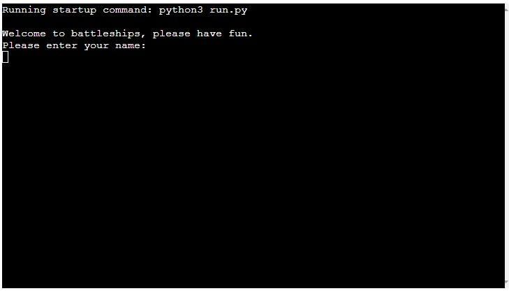
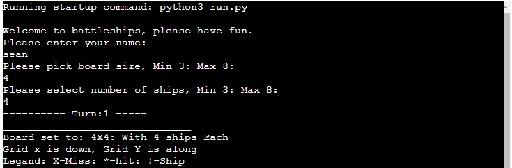
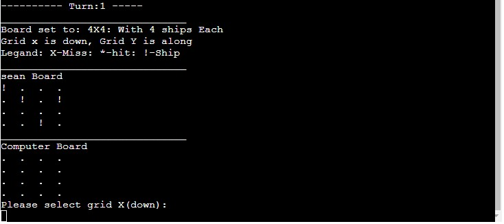
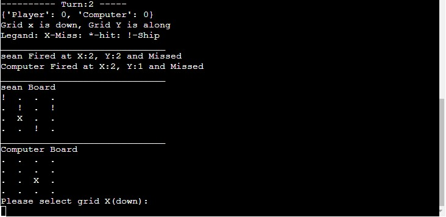
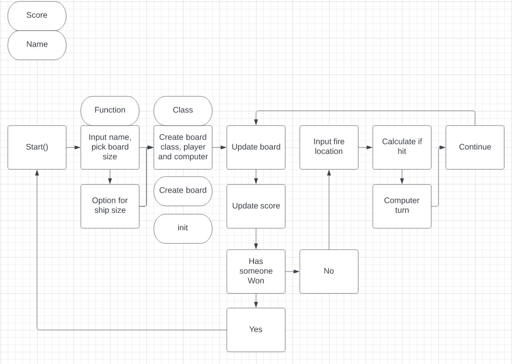

# Battleships
Battleships is a python based game using full stops as the board and ! as ships.

Your objective is to destroy all the computers ships before they destoy yours, or end in a draw.

## User Stories

- __Stories__

    - I want to play a good old fashioned game of battleships
    - Did i hit the ship, did they hit my ship
    - I want to select where my shots go
    - I want to know who is winning at all times
    - I want to know who has won

## How to play

- __Setup__

    - Enter your name
    - Select the board size
    - Select number of ships

- __The main game__

    - Select between 0 and max board size to go down on board, then select between 0 and max to go across on the board, 0, 0 is the top left.

Each turn the player will be shown the two boards, and any misses marked with X, they will also be shown  ships with ! and hits on ships with *, however they will only see their own ships.
For the turn the player will be prompted to enter an X on the grid, then a y, this will then fire the shot, the computer will then fire and you will be shown if the player and computer hit or miss.
The game will continue like this until the player or computer sinks all the others ships, or if there is a draw.

## Features

- __Implemented Features__

    - Welcome screen

- Player is able to select the size of the board from 3x3 to 8x8.
- Player is able to enter there name and this will be shown when they fire their shots.
- Player is able to select how many ships they will play with.

- player will play against the computer.
- player can input where there shots will go.

- Scoreboard will show at all times who is winning\losing.
- checks in place to make sure users cant have to many or to little ship.
- Checks in place for validation for X and Y positions.
- For each X and Y, this will be checked to make sure you dont waste a shot if you have fired there before.

- __Future Features__

    - Two players on the same machine
    - Have a larger score function that would keep track of how many full games you have won versus the computer
    - Add a handicap(difficulty), this would give the computer say 2 turns, or have less or more ships

## Technology

- Python
    - Python was the only language i used for this application.

## Data Model

The data model is based around a class called board, the class stores information such as name, how many ships, the type(player or computer) the board size and score. The class also has return functions to check if a grid(x, y) has a ship, or has been shot in the past.

The game also uses a main function running in a while loop that will continue the game until the player or computer has hit all ships.

## Testing

I have tested the application in gitpod(python3 run.py), tested on the deployed version [Live version](https://sean-clark-project-3.herokuapp.com/) and [pep8online](http://pep8online.com/) for code validation.

- Tested with stings when it should be ints, tested ints when it should be stings, checked for empty input(this is allowed for user name if left blank the name is set to player).
- Tested on windows 10 and 11 pc

- __Code__

    - Python
        - Tested Python code though [pep8online](http://pep8online.com/checkresult).

- __Spellchecker__

    - [Online Spellchecker](https://www.online-spellcheck.com/).

- __Bugs / Issues__

    - Fixed
        - a few issues with indexing 0.
        - forgetting to convert input to ints and having errors.

    - Unfixed
        - No unfixed

__Accessibility__

## Deployment

- GitPod was used to create\ gitpod for version control and heroku to deploy [Live version](https://sean-clark-project-3.herokuapp.com/).

- Heroku
    - Deployment from heroku involved signing up to the site, then you need to click create your first app. to deploy my project i went to settings tab, click on add config vars, click on add and set to PORT with value 8000, I also had to set the build packs for Python then Node.js, once done i then clicked on the deploy tab linked to my github, selected the main branch then deployed, i set this to automatic deploys so when ever i made a change it would do it.

- GitPod
    - Deployment from gitpod was done by adding changes to the python3 command line, command to add changes git add ., adds each file to the awating commit, then type in commit -m "changes in here", once i was happy with that i could then push them to github, using git push command, as i set up heroku with auto deploy it would pull the updates sent from github.
    - python3 command line > git add ./or file name > git commit -m "information in here" > git push to send changes to github

## Credits

- __References__

- Code
 - Some code ideas came from the love sandwiches project and the ultimate battleships video